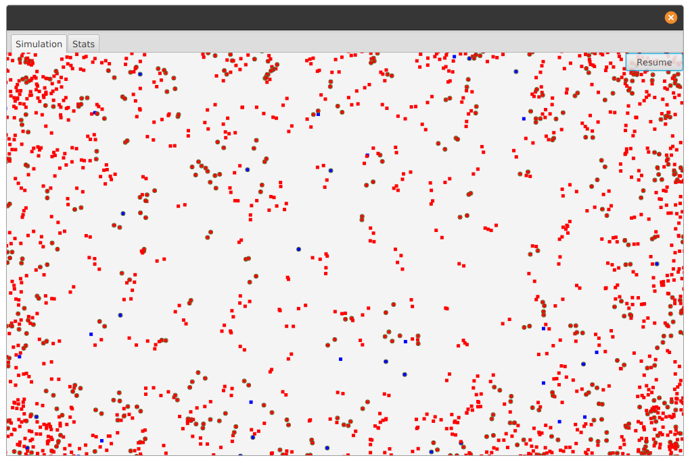
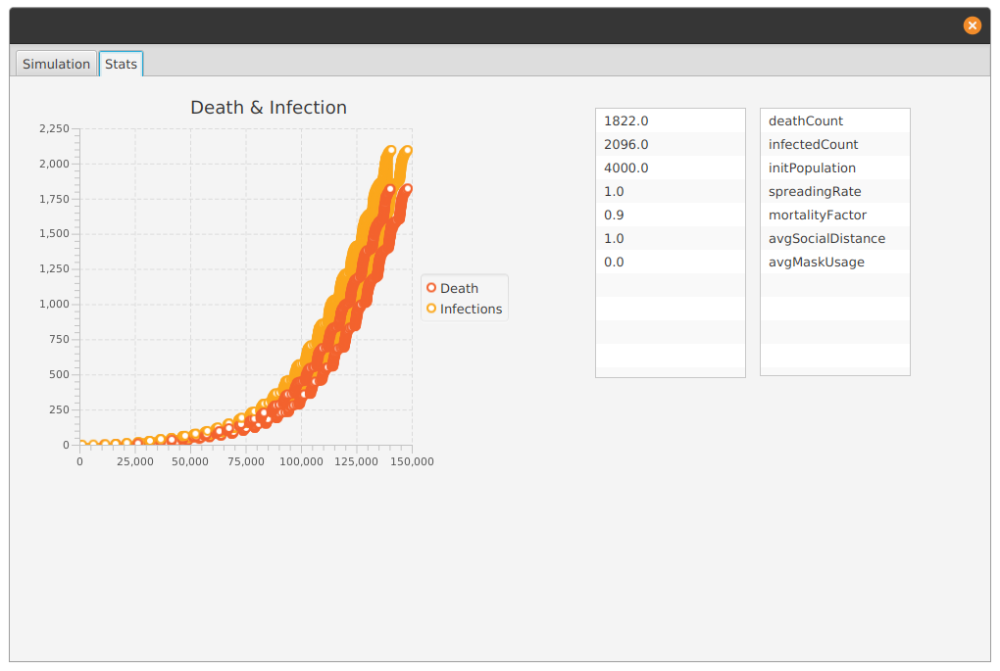

## Intro
An epidemic simulation with visuals to practice design patterns. Many design principles was in my mind while I implemented it. Put extra effort to get familiar with modern Java practices with functional programming paradigms which I love. An over-engineered example for sure...

## How To Run
Make sure you have maven and javac then you can type:
```
mvn clean javafx:run
```
## GUI
## Visual
Red squares: People currently in social interaction.  
Blue squares: People walking around without social interaction.  
Squares with green circles: Infected people.  

## Real-Time Plot
Stats are gather by a decorated component of the simulation to demonstrate the decoupling of components.


## Design
Used [Component Pattern](https://gameprogrammingpatterns.com/component.html). Similar to what Unity has. See ```media/diagram``` for more.  
Why so over-engineered? Because the main purpose was to practice...